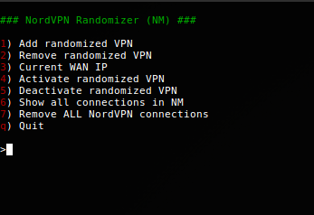

# nordvpn_randomizer-nm  (Network-Manager Edition)

**Note**, this was written while bored and drunk mainly on my cell phone so the code is crude, but working just fine. I will improve it when time allows for it. Better usage/installation instructions included.


<p align="center">
  
</p>


This script is tested on Linux Mint (18.3) and should work on all Ubuntu-derivaties and debian with minimal or no changes.

This Bash script was created for simply randomize the available [NordVPN](https://nordvpn.com/) OpenVPN UDP files for a specific country choosen by the user. This script is also provided AS-IS and is a work in progress when I have some time over.

```
$> sudo apt-get update
$> sudo apt-get install unzip dnsutils ca-certificates network-manager-openvpn-gnome -y
$> sudo service network-manager restart
$> cd /etc/openvpn
$> sudo wget https://downloads.nordcdn.com/configs/archives/servers/ovpn.zip
$> sudo unzip ovpn.zip
$> sudo rm ovpn.zip
$> sudo nano auth.txt   # Add your NordVPN username on the first line and your password on the second line.
$> sudo chmod 0600 auth.txt
$> sudo chmod 0700 ovpn_udp ovpn_tcp
$> mkdir ~/sources && cd ~/sources   # If you have a different git dir just exchange sources with yours.
$> git clone https://github.com/damianrath/nordvpn_randomizer-nm.git
$> sudo ln -s ~/sources/nordvpn_randomizer-nm/nordvpn_randomizer-nm /usr/local/bin/
$> sudo nordvpn_randomizer-nm
```

After you have run the script (as root) it will provide you with a menu of options. Here you can add and remove a randomized VPN. When you add a VPN it will ask you for a country-code. If you don't know which country-codes that are available you can just press ENTER and a list will be provided for you. Afterwards it will add a randomized VPN to your Network-Manager (GUI), based on your country selection, where you can select to start/stop it like normal.

When you want to get a new randomized VPN you just start this script again and use the second option on the menu. It will check if the VPN in question is started and stop it if necessary. After that it will remove it from the Network-Manager list. When that's done you can just choose the first option on the menu and the script will provide you with a new randomized VPN.


The script also has command line parameters for the main functionality. nordvpn_randomizer-nm --help


That's it!


## TODO

- Clean up the script. Drunk coding ftw.
- Elaborate more in the README.
- Add some more features.
- Add more error checking for the shellscript-challenged people.


## Disclaimer

I'm not affiliated with [NordVPN](https://nordvpn.com/) in any way except being a normal customer that enjoys their services.
